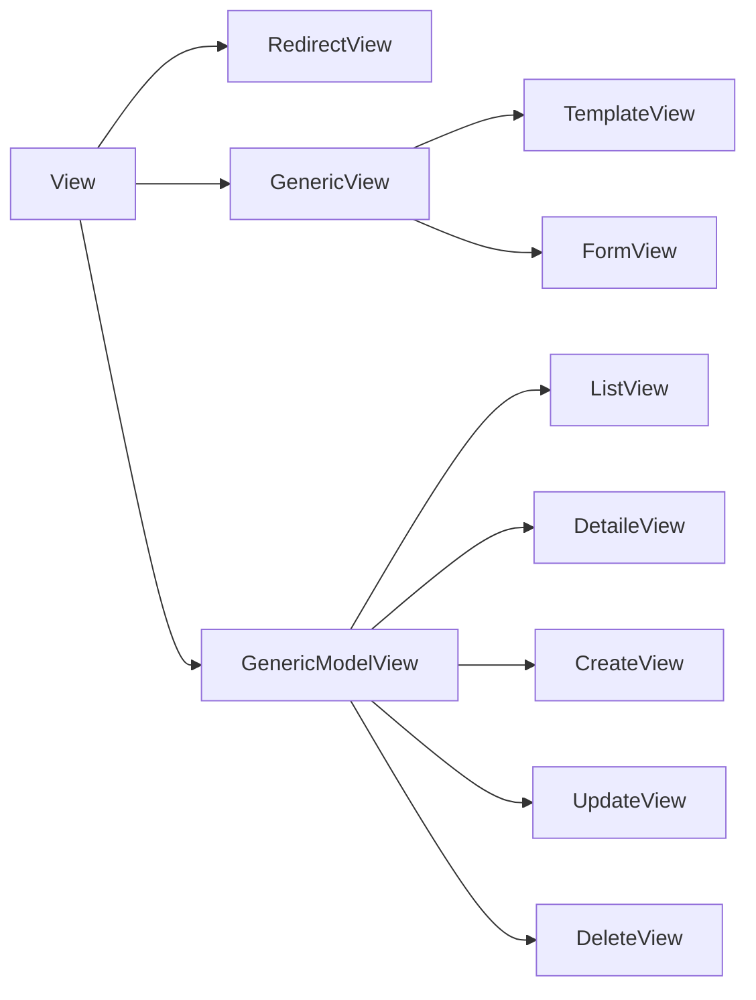

### DRF
##### Permissions
```python
from rest_framework import permissions

class IsOwnerOrReadOnly(permissions.BasePermission):
    """A custom permission to only allow owners of an object to edit it"""
    def has_object_permission(self, request, view, obj):
        if request.method in permissions.SAFE_METHODS:
            return True

        return obj.user == request.user
```
##### Basic view
```python
class ListUsers(APIView):
    authentication_classes = [authentication.TokenAuthentication]
    permission_classes = [permissions.IsAuthenticated]

    def get(self, request, format=None):
        users = User.objects.all()
        return Response(users)
```
##### Mixins
Use `GenericAPIView` with *Mixins*: `CreateModelMixin`, `ListModelMixin`, `RetrieveModelMixin`, `DestroyModelMixin`, `UpdateModelMixin`
`GenericAPIView` несет в себе сразу много готовых функций, таких как: `get_serializer_context`, `get_serializer`, `paginate_queryset`, `get_paginated_response`, `filter_queryset`
##### ViewSets
```python
class QuizViewSet(viewsets.ModelViewSet):
    serializer_class = QuizSerializer
		# можно обозначать разрешенные методы так, а можно как в примере дальше
    http_method_names = ["get", "post", "put", "delete"]
    permission_classes = [IsAuthenticated, IsOwnerOrReadOnly]
		# фильтр для поиска и поля поиска
    filter_backends = [filters.SearchFilter]
    search_fields = ["title", "tags__title"]
    queryset = Quiz.objects.all()

    def get_serializer_class(self):
        if self.action == "retrieve":
            return QuizWithQuestionsSerializer
        return QuizSerializer
```
А ниже все то же, только с нужным функционалом и не более
```python
class ReactionViewSet(
    mixins.CreateModelMixin,
    mixins.UpdateModelMixin,
    mixins.DestroyModelMixin,
    viewsets.GenericViewSet
):
    serializer_class = ReactionSerializer
    queryset = Reaction.objects.all()
    permission_classes = [IsAuthenticated, IsOwnerOrReadOnly]
```
### Django


##### Basic example
```python
class SpendingsListView(LoginRequiredMixin, ListView):
    template_name = "web/spendings.html"

    def get_queryset(self):
        if self.request.user.is_authenticated:
            return Spending.objects.filter(Q(user=self.request.user) &
                                           Q(created_at__gte=date.today()-timedelta(weeks=1))).order_by("-created_at")
        return Spending.objects.none()

    def get_context_data(self, *, object_list=None, **kwargs):
        if not self.request.user.is_authenticated:
            return {}
        return {
            **super(SpendingsListView, self).get_context_data(),
            "form": SpendingForm,
        }
```

