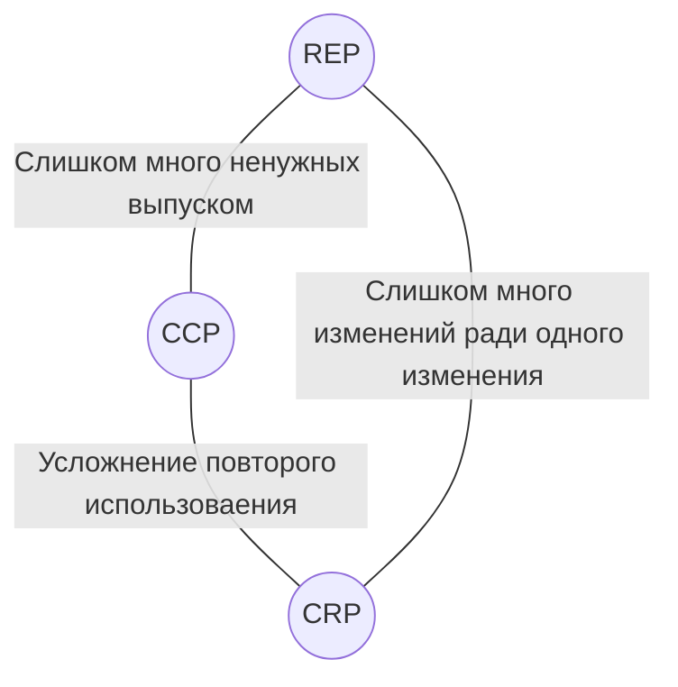

### REP
**Reuse Equivalence Principle** - принцип эквивалентности повторного использования.
*Единица повторного использования есть единица выпуска.*
Каждые переиспользуемые компоненты должны пройти процедуру выпуска и получения версии.
Не обязательно из-за совместимости, а для того, чтобы отслеживать функционал и изменения, которые произойдут, чтобы планировать использование старой версии или переход на новую.
### CCP
**Common Closure Principle** - принцип согласованного изменения.
*В один компонент должны включаться классы, изменяющиеся по одним причинам в одно время.*
Этот тот же принцип единственной ответственности, но перефразированный для компонентов.
Этот принцип требует от нас, чтобы мы собирали вместе все классы, которые может понадобиться изменить по одной, общей причине.
Так же этот принцип тесно связан с OCP (Open-Closed Principle), т.к. мы проектируем свои классы так, чтобы они были закрыты для изменений, наиболее типичных из ожидаемых по опыту.
Увеличиваем вероятность, что изменение требований повлечет необходимость изменять минимальное количество компонентов.
### CRP
**Common Reuse Principle** - принцип повторного совместного использования.
*Не вынуждайте пользователей компонента зависеть от того, чего им не требуется.*
То есть принцип указывает, что в компонент нужно включать классы и модули, которые используются совместно. Одновременно с этим он указывает и на то, какие компоненты не должны включаться.
Этот принцип является более общей версией ISP (Interface Segregation Principle).
Не создавайте зависимостей от компонентов, имеющих неиспользуемые классы.
## Противоречия
Первые два принципа пытаются делать компоненты обширнее, тогда как третий наоборот, пытается делать их меньше.

